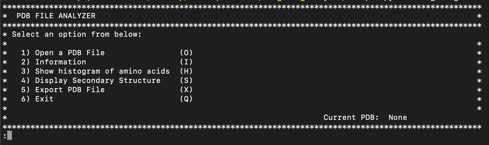

# Description
 
The PDB File Analyzer program extracts information from PDB files that refer to 3D structures of proteins and executes basic analysis on the files. Although the biopython library can process this file format, my objective of undertaking this project was to develop python programming skills by writing custom python functions.

## Usage
The Script directory has the program file that can be run on Python v 3.5 and above. The program can be run on a python IDE or by simply calling python on the Bash terminal. After running the script, the menu below will be displayed from which a user has to enter a PDB file before proceeding to use the other menu options. The data directory has a PDB file used for testing and running the program. 

{: .bash}
### Program menu

Once a valid PDB file is loaded into the program, the user can proceed to explore the different menu options. For example, if a user wants to see the secondary structure of a protein, they would choose option 4 which would print the protein's secondary structure.
The export function currently only prints the results of the Information option to a txt file in the Results folder. 

## Credits
This Project was designed by [Gustavo Salazar]()

